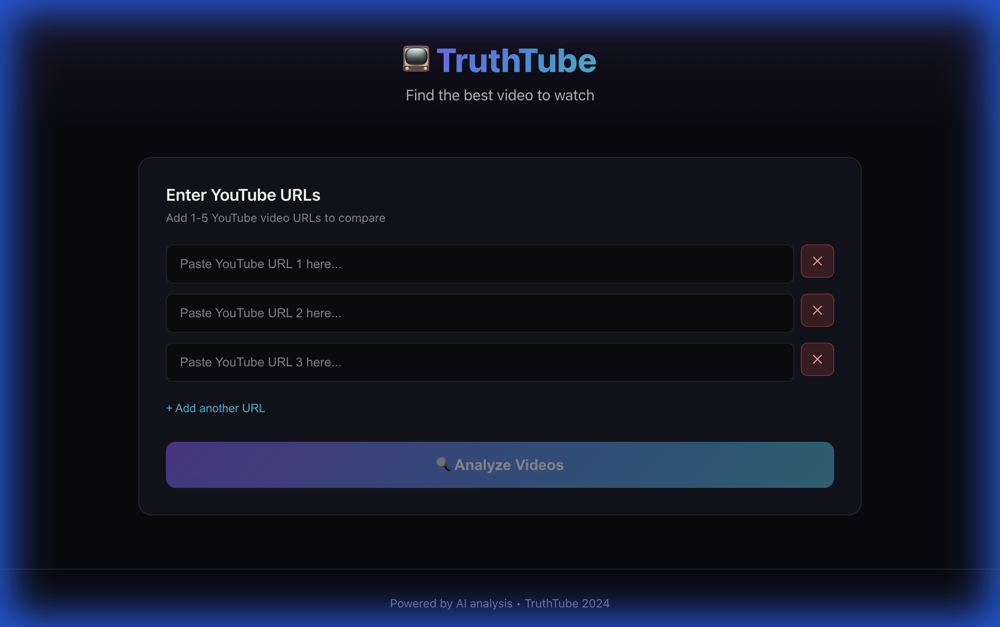

# 📺 TruthTube

**Find the best video to watch** — An AI-powered YouTube video quality analyzer that helps you choose the most informative video on any topic.



## What It Does

TruthTube analyzes YouTube videos across four key metrics:

| Metric | Description |
|--------|-------------|
| **Density** | Information density — facts and insights per minute |
| **Redundancy** | Filler content, repetition, and fluff (lower is better) |
| **Title Relevance** | How well content matches the title, clickbait detection |
| **Originality** | Unique perspectives compared to other submitted videos |

Simply paste 1-5 YouTube URLs, and TruthTube will analyze and rank them, helping you identify the highest-quality content.

## Tech Stack

**Backend:**
- FastAPI (Python 3.11+)
- LangChain + OpenAI GPT-4o-mini
- LangGraph for workflow orchestration
- YouTube Transcript API

**Frontend:**
- React 18 + Vite
- Vanilla CSS (dark theme)

## Quick Start

### Prerequisites

- Python 3.11+
- Node.js 18+
- OpenAI API key

### 1. Clone the repository

```bash
git clone https://github.com/yourusername/TruthTube.git
cd TruthTube
```

### 2. Set up the backend

```bash
cd backend

# Create virtual environment
python3 -m venv venv
source venv/bin/activate  # On Windows: venv\Scripts\activate

# Install dependencies
pip install -r requirements.txt

# Configure environment
cp .env.example .env
# Edit .env and add your OPENAI_API_KEY
```

### 3. Set up the frontend

```bash
cd frontend
npm install
```

### 4. Run the application

**Terminal 1 — Backend:**
```bash
cd backend
source venv/bin/activate
uvicorn app.main:app --reload --port 8001
```

**Terminal 2 — Frontend:**
```bash
cd frontend
npm run dev
```

### 5. Open the app

Navigate to **http://localhost:5174** in your browser.

## API Endpoints

| Endpoint | Method | Description |
|----------|--------|-------------|
| `/api/health` | GET | Health check |
| `/api/analyze` | POST | Analyze 1-5 YouTube videos |
| `/api/agents/density/test` | POST | Test density agent |
| `/api/agents/redundancy/test` | POST | Test redundancy agent |
| `/api/agents/title/test` | POST | Test title relevance agent |
| `/api/agents/originality/test` | POST | Test originality agent |

## Environment Variables

Create a `.env` file in the `backend/` directory:

```env
OPENAI_API_KEY=your-openai-api-key
OPENAI_MODEL=gpt-4o-mini
ENVIRONMENT=development
```

## Project Structure

```
TruthTube/
├── backend/
│   ├── app/
│   │   ├── agents/       # LLM-powered analysis agents
│   │   ├── api/          # FastAPI routes
│   │   ├── models/       # Pydantic schemas & DB models
│   │   ├── services/     # YouTube service
│   │   ├── workflow/     # LangGraph orchestration
│   │   └── main.py       # App entry point
│   ├── requirements.txt
│   └── .env.example
├── frontend/
│   ├── src/
│   │   ├── components/   # React components
│   │   ├── services/     # API client
│   │   └── App.jsx
│   └── package.json
└── README.md
```

## How It Works

1. **Transcript Extraction** — Fetches video metadata and transcripts from YouTube
2. **Parallel Analysis** — Runs density, redundancy, and title agents concurrently
3. **Cross-Video Comparison** — Originality agent compares all videos together
4. **Ranking** — Calculates weighted scores and ranks videos

## License

MIT
